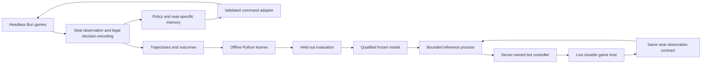

# Implementation plan: Crossfire AI opponents

Status: headless training, specialist models, the dashboard and expandable
training rosters are implemented. Continuous training is stopped. Production
leader releases, live-game dataset export/import and full milestone acceptance
below remain pending. See the dated implementation updates below.
Feature requirements and product scope: [task.md](task.md).

## Working approach

The initial two-deck experiment now extends to the six user-pinned decks, with
complete-game/replay coverage and continuous round-robin training. Qualify the
learned policy before integrating a selected checkpoint with Crossfire's durable
game hosting and UI. Keep the distinction between running learning updates and
proving useful playing strength explicit.

The following is the target layout. The tactical subset under `play/ai/` and
`play/testing/ai/` now exists alongside the initial full-game trainer; live integration is proposed:

| Proposed area                                                                                | Responsibility                                                                                                                 |
| -------------------------------------------------------------------------------------------- | ------------------------------------------------------------------------------------------------------------------------------ |
| `play/ai/`                                                                                   | TypeScript observation/command adapters, baseline policies, experiment protocol, model metadata, and live bot controller.      |
| `play/ai/training/`                                                                          | Separately locked Python environment, model, recurrent PPO, opponent pool, checkpointing, and evaluation tooling.              |
| `play/testing/ai/`                                                                           | Original Crossfire adapter, privacy, tactical, and replay fixtures/tests.                                                      |
| Existing `play/worker`, `play/storage`, `server/lib/crossfire`, and frontend Crossfire areas | Bot admission, persistence, scheduling, inference integration, and UI extensions.                                              |
| Local ignored artifact directory, initially under `.swubase/crossfire-ai/`                   | Experiment logs, generated trajectories, checkpoints, and reports. Published models need a separate explicit release location. |

Do not add another workspace/package boundary until the Python tooling or
existing import checks require it. Root/frontend application installation must
not require a GPU or install Python training dependencies.

Simulation workers may hold authoritative state; the policy request contains
only the acting seat's permitted observation. Training examples also include
the chosen action, its behavior-policy probability, seat/model identity,
episode boundaries, and eventual rewards. Human games enter this pipeline only
through the separately authorized export and offline import workflow in M8.

## Required skills and source documents

Before each milestone, re-read the repository selection matrix. All source,
test, schema, configuration, or tooling changes require
`swubase-change-review` and `swubase-validation`, including the independent,
read-only local Claude Code review when available. Report an unavailable review.
Documentation-only updates do not trigger that code-review requirement.

| Work                                                                 | Skills to load                                                                                                                                                                                                 |
| -------------------------------------------------------------------- | -------------------------------------------------------------------------------------------------------------------------------------------------------------------------------------------------------------- |
| M0–M5: simulation, observations, learning, evaluation, model serving | `swubase-online-play`, `swubase-architecture`, `swubase-validation`, `swubase-change-review`; `swubase-documentation` for maintained experiment/runbook documents.                                             |
| M6: bot seats, admission, durable scheduling                         | Above plus `swubase-auth-permissions`, `swubase-backend-endpoints`, `swubase-database-migrations`; add `swubase-websockets` when changing transport/publication.                                               |
| M7: player UI and operations                                         | `swubase-online-play`, `swubase-frontend-components`, `swubase-frontend-api`, `swubase-frontend-routing`, `swubase-backend-endpoints`, `swubase-validation`, `swubase-change-review`, `swubase-documentation`. |
| M8/M9: wider decks, demonstrations, optional search                  | Core AI skills above; add `swubase-decks`/`swubase-card-catalog` for deck/catalog workflows; `swubase-development-data`, `swubase-auth-permissions`, `swubase-database-migrations`, `swubase-backend-endpoints` and the frontend skills for opt-in, export/import and retention. |
| Independent leader releases and AI administration                  | `swubase-architecture`, `swubase-online-play`, `swubase-backend-endpoints`, `swubase-database-migrations`, `swubase-frontend-api`, `swubase-frontend-components`, `swubase-frontend-routing`, `swubase-validation`, `swubase-change-review`, `swubase-documentation`; auth/development-data skills when adding policy or storage fields. |
| Local environment or launcher changes                                | `swubase-worktree-dev`; add `swubase-validation` and `swubase-change-review` for tooling edits.                                                                                                                |

Read the current [engine guide](../../../docs/crossfire/engine-core.md),
[operations guide](../../../docs/crossfire/architecture-and-operations.md),
[card release contract](../../../docs/crossfire/card-releases.md), and
[regroup/resource plans](../../../docs/crossfire/regroup.md).
For live integration also read [storage](../../../docs/crossfire/storage.md),
[lobbies](../../../docs/crossfire/lobbies.md),
[connections](../../../docs/crossfire/connections.md),
[worker lifecycle](../../../docs/crossfire/worker.md),
[transport](../../../docs/crossfire/transport.md),
[history](../../../docs/crossfire/history.md),
[statistics](../../../docs/crossfire/statistics.md), and
[frontend](../../../docs/crossfire/frontend.md).
Read [migrations](../../../docs/migrations.md) completely before schema work.

## Implementation update — 2026-09-21

The user selected a small end-to-end learning demonstration as the first chunk.
See [the runnable experiment](../../../docs/crossfire/ai-experiment.md).

- [x] Local seeded full-game arena and benchmark using projected commands,
      synthetic practice decks, and sampled replay verification.
- [x] Original win-now / stop-lethal tactical scenarios resolved by Crossfire,
      with seat-visible features and an isolated persistent Bun/Python bridge.
- [x] Feature-level train/validation/test partitioning, held-out evaluation,
      and comparisons against random, always-base, and untrained policies.
- [x] Small CPU neural network trained from sampled engine outcomes, saved with
      checksummed compatibility metadata, and reloaded in a separate evaluator.
- [x] Local HTML/JSON reports and focused protocol, privacy, replay, and model
      persistence tests.

This tactical slice uses one-step REINFORCE for short exercises. By itself it does not
implement full-game PPO, recurrent knowledge/memory, the complete selection
contract, a competitive baseline, the two-deck full-game learning gate, or
website bot seats. Synthetic benchmark decks are not the two complete evaluated
decklists required by M0. Keep the corresponding milestone boxes pending.

Measured evidence: `run-02` trained on 76,800 sampled tactical positions in
about 271 CPU seconds and saved 5,441 parameters (24,533 bytes). Frozen evaluation
scored 509/512 overall, including 235/235 immediate wins and 274/277 defenses;
the tactical gate passed. The test schedule was reused after `run-01` missed
the defensive gate. See the experiment guide for the complete comparison,
checksum, reproducible commands, benchmark, and interpretation limits.

Validation: `bun run play:check` passed type checking, import boundaries, and
3,275 tests across 152 files (73,032 assertions, zero failures). The three Python
unit/integration tests passed. Formatting, all 45 local documentation links,
and tracked/new-file whitespace checks passed. Chromium opened the generated
report without page errors; its comparison and example tables were inspected.

The independent Claude review was attempted but could not authenticate because
its OAuth session had expired. Local code review and focused validation ran;
do not treat this as a completed independent review.

## M0 — Define and measure the first experiment

### Full-game development run — 2026-09-21

The user initially authorized training with a hard maximum of **3 CPUs and 100 GB of disk**;
the CPU allowance was subsequently raised to nine logical CPUs, with disk unchanged.
The [full-game trainer](../../../docs/crossfire/ai-full-game-training.md) adds
the exact pinned Greef/Dedra decks, projected observations with both-seat event
updates, sequential legal command construction, a persistent Bun worker,
reference imitation followed by full-game PPO, a three-snapshot opponent pool,
rotating checked checkpoints and explicit cutoff/failure handling. The run uses
Linux CPU affinity and bounded artifact writes including the local environment.

The initial eight-game smoke completed all games, made two imitation updates
and one PPO update, and reloaded its frozen artifact exactly. The shared network
has 146,850 parameters and a roughly 594 KB weight artifact. Initial artifacts
use about 1.02 GB including dependencies. The longer development run is bounded
to 5,000 games or two hours, with 24 reference warm-up games.

`full-run-01` exposed a reproducible pipe-buffer boundary timeout after 16
completed games. The JSONL writer now awaits a single write containing the
newline; the previously failing seed/request-ID regression passes. The failure
trace is retained and training restarted in `full-run-02`. All seven Python
checks pass. The required independent Claude review and a focused follow-up
both failed authentication; local review and validation were completed instead.
Type checking, import boundaries and 11 focused AI tests passed. The full engine
suite recorded 3,279 passes and one 15-second Support replay timeout under shared
CPU load; that exact test passed in 12.05 seconds with training briefly suspended.
Training workers were resumed after the check. The full-suite command therefore
had a nonzero exit despite the successful isolated recheck; no engine rule was
changed for that result.

### Parallel collection update — 2026-09-21

The serial trainer used about 1.33 CPU cores despite its three-CPU allowance.
The collector now batches inference across up to three independent persistent
Bun simulators. All workers share the same three-CPU affinity. Weights stay
fixed for a full collection wave; inference and RNG remain on the main thread.
Paired repeated benchmarks measured 39.3/49.7/55.1 games per minute with 1/2/3
workers, respectively, with identical seeded command counts and outcomes.

Graceful checkpoint resume now restores checked weights, optimizer state,
opponent pool, RNG and counters into a new run directory. Active/failed runs
and checkpoints with unfinished collection data are rejected. Crash recovery
of an unfinished rollout remains pending. The resumed smoke added 12 terminal
games and a PPO update. `full-run-03` continues from 1,123 collected games and
125 updates with three workers, preserving the original two-hour deadline and
5,000-game total limit. The 100 GB artifact budget remains unchanged.

All ten Python tests passed, including game isolation, serial/parallel parity,
mixed opponent filtering, cutoffs and optimizer/RNG restore. This change touches
only Python training and documentation, so the prior engine-suite evidence
above remains applicable. Claude's read-only review was attempted but its OAuth
session remains expired. See the [training guide](../../../docs/crossfire/ai-full-game-training.md)
for reproduction commands and benchmark limits.

### Nine-CPU allowance — 2026-09-21

The user raised the maximum to nine logical CPUs; disk remains capped at 100 GB.
`--cpus` is parsed before numerical libraries or workers start, defaults to three,
and cannot widen the inherited affinity mask or exceed nine. Worker concurrency
is independently bounded at nine. Tests verify limits and child inheritance.

A repeated 18-game comparison measured 54.6 games/minute at 3 CPUs / 3 workers,
58.4 at 9 / 3, 81.3 at 9 / 6 and 92.8 at 9 / 9. All 144 games completed with
matching outcomes and command counts. The selected 9 / 9 configuration provides
about 70% more collection throughput; optimization/evaluation overhead is not
included in that comparison. `full-run-04` resumes game count 1,714 and update
169 from the prior final checkpoint, keeping the original stop deadline and
5,000-game cap. All 12 Python tests passed. The independent Claude review was
attempted but its OAuth authentication remains expired.

The next throughput pass reuses the training host's private state snapshot,
resolves forced command components without inference, and schedules ready
workers independently. Collection windows queue twice the worker count and
keep model weights fixed until admitted games drain. Deadline/stop handling
does not admit queued games; per-game random streams avoid arrival-ordered
sampling. Exact complete-game observation/recording parity, blocked-worker
refill, cutoff accounting and sampled serial/parallel comparisons are covered.
On the same `full-run-04` checkpoint, 18 fixed greedy games repeated twice
improved from 115.9 to 214.0 games/minute with the same nine-CPU budget. All 72
before/after games had matching outcomes and command counts. This is collection
throughput, excluding optimization/evaluation, and does not qualify strength.
All 3,282 Crossfire tests and 14 Python tests passed, along with type/boundary
checks and the replay demo. `full-run-05` resumes game 2,560/update 217 with the
original 11:20 UTC deadline and 5,000-game cap. Claude review remains unavailable
because its OAuth session expired; local review found no outstanding issue.
See the full-game guide for reports and operational state.

The next CPU pass adds an explicit immutable training mode to the projector:
cached views and bounded scoped-identifier caches, with incremental visible
events. Default browser/replay projections still return full histories.
Development evaluation now uses the existing worker pool without retaining
training rows or consuming learner RNG. With the final game-5,000 checkpoint,
matched collection rose from 230.0 to 277.0 games/minute; the eight-game
evaluation pause fell from 4.91 to 3.07 seconds on the optimized simulator.
The separate `projection-smoke-01` run added 108 terminal games and three PPO
updates, exercised parallel evaluation and verified checkpoint reloads. No long
run was restarted. All 3,286 Crossfire tests, 16 Python tests, type/boundary
checks and the replay demo passed. Local review found no outstanding issue;
Claude review could not authenticate because its OAuth session expired.
Measurement scope, validation and the IPC profile are in the
[full-game guide](../../../docs/crossfire/ai-full-game-training.md).

- [ ] Benchmark a bounded Bun loop through reference-opponent decisions until
      the next learner decision. Preserve visible memories, command/replay
      parity, generation/ticket validation, teacher rows and shutdown behavior.
- [ ] Measure invariant per-game payload reuse, then compare reduced JSON with
      a versioned binary numeric frame. The current profile's dense float32
      arrays are larger than its JSON; qualify CPU, bytes and full throughput
      before selecting a transport. Keep framing/timeout regressions covered.

This deliberately smaller M1–M4 development slice uses lossy visible-event
memory and component-level PPO, not the planned recurrent/relational encoder.
The adapter fails explicitly on unsupported combined constraints. The reference
is not a qualified competitive baseline. Exhaustive choice coverage, automatic
checkpoint resume, held-out strength qualification, all six decks and live bot
hosting remain pending. The milestone boxes below describe their full target
acceptance; starting training does not mark them complete.

- [x] Select two complete, supported fixed decklists and pin their catalog and
      engine versions. Greef/Dedra is the initial pair, both orientations with
      varied opening initiative; [the roster](training-roster.md) preserves all
      six user-selected lists, strategy notes, counter cases, and expansion order.
      All six passed admission against the pins in [selected-decks.json](selected-decks.json).
- [ ] Inventory every decision and command payload reachable by those lists.
      Include optional effects, searches, replacements, trigger order, and resource
      selection; classify gaps before defining the model's action contract.
- [ ] Define separate training, development, and final evaluation seed pools;
      choose original tactical positions and a baseline policy version.
- [ ] Measure full-game wall time, decisions/game, peak memory, option/selection
      sizes, and terminal/aborted outcomes for both short and long games. Report
      single-worker and bounded concurrent-worker throughput with hardware details.
- [ ] Profile engine stepping, copying, projection/history encoding, IPC, and
      inference separately. Do not use the demo's replay-every-command loop as the
      production training runner. Preserve normal engine semantics and replay checks
      on sampled trajectories when removing harness-only overhead.
- [ ] Set explicit CPU/GPU, memory, artifact, wall-clock, and decision limits
      for the first training run. Estimate cost from measured throughput; make no
      promise about games/day or hours-to-strength before this measurement.

**Exit:** a runnable benchmark and recorded experiment configuration with two
deck snapshots, a decision inventory, compute limits, and agreed evaluation
rules. Long training does not begin before these are known.

## M1 — Implement the headless environment and knowledge boundary

- [ ] Add a reset/observe/step/result interface around the existing engine or
      `LocalGame`, with seeded host randomness for experiments and no database/UI.
      Advance random requests internally until a decision or a terminal result.
- [ ] Choose the acting seat from the current engine decision, not an alternating
      counter or only `activePlayer`. Nested choices may belong to the other player;
      extra actions can leave the same player choosing again. Bot resource choices
      can wait for the ordinary ordered decision instead of early confirmation.
- [ ] Define a versioned numeric observation from `Projector` semantics: own
      hand/resources, public board and discards, counts, initiative/phase/round,
      usage limits, scheduled effects, inspected cards, and legitimate event history.
      Enrich visible card identities from the pinned public card definitions when
      needed; never use that lookup to identify a face the seat cannot see.
- [ ] Normalize self/opponent and encode card/action features. Opaque viewer
      handles are command-routing references, not learned identity features. Track
      exact visible copies and attachments without leaking hidden identity continuity.
- [ ] Include the bot's own deck composition from the first full-game experiment.
      Distinguish ordinary resources and Credits, card naming/ability suppression,
      and usage limits. Add the roster's strategy exercises with counterexamples;
      keep expert style descriptions out of hardcoded reward bonuses.
- [ ] Define event-history updates for each seat, including observations gained
      while the other seat is acting. Memory must not omit a reveal simply because
      it occurred between that seat's decisions. Reset memory at game/branch changes.
- [ ] Implement the complete action adapter: option plus constrained selections,
      ordered selections, allocations, named-card/number payloads as applicable.
      Use sequential component selection when combinations are large; keep at least
      one legal completion available and validate the final command through the engine.
- [ ] Separate terminal wins/draws, training cutoffs, invalid commands, and engine
      failures. Persist a private reproducible failure artifact and surface the cause.
      Never convert unsupported choices or timeouts into wins or genuine draws.
- [ ] Add a persistent, version-negotiated Bun/Python bridge. Batch independent
      games, correlate requests, bound payloads and queues, and fail cleanly if a
      worker dies. Do not spawn a process per decision.

**Exit:** both selected decks complete seeded episodes with valid commands;
sampled recordings replay identically. With unchanged seat knowledge/history,
varying inaccessible hands/resources/deck order leaves encoded observations,
legal-action descriptions, and policy inputs unchanged. No raw state crosses
the policy boundary. Cover cross-seat and cross-game memory isolation.

## M2 — Establish baselines and an independent evaluator

- [ ] Add a seeded random legal baseline for adapter diagnostics and a modest
      scripted baseline using only seat-visible information. Cover immediate wins,
      obvious defense/trades, development, resourcing, and initiative decisions.
      Share the same decision/command interface with trained policies.
- [ ] Build tactical cases for lethal, prevention of lethal, Sentinel/trades,
      arena selection, resource preservation, deployment/ability timing, initiative,
      and compound choices reached by the initial decklists. Separate training
      curriculum positions from held-out assessment positions.
- [ ] Run baseline tournaments with both seat/deck orientations and varied
      opening initiative. Record wins, losses, draws, cutoffs, failures, move latency,
      and seeds. Report results per matchup/orientation as well as aggregate.
- [ ] Compare policies on paired seed schedules. Compute uncertainty using the
      paired schedule as the sampling unit where games are correlated; do not claim
      independent observations by counting both sides of the same game twice.
- [ ] Freeze the baseline and final-test schedule before selecting a trained
      checkpoint. Use development results during tuning; run final evaluation only
      on selected candidates and disclose repeated comparisons.

**Exit:** reproducible baseline results and a meaningful test suite. Proposed
first learning gate: at least 1,000 held-out completed games across both
orientations, aggregate win score above 60% against the scripted baseline,
and a 95% interval lower bound above 50%. A draw scores 0.5. Also require no
unhandled/invalid decisions, no information leaks, and all unambiguous tactical
gates passing. Report all aborted/cutoff runs separately and investigate them;
do not exclude failures silently to improve the score. M0 may revise these
proposed thresholds before training if the compute budget requires it.

## M3 — Implement and smoke-test the learner

- [ ] Add a separately pinned Python/PyTorch environment and a small card/entity
      encoder with a recurrent history component, candidate-action policy scorer,
      and seat-visible value head. Start small; model size is an experimental setting.
- [ ] Implement PPO with masks for available choices and padded candidates.
      For composite commands, store component masks and sum conditional log
      probabilities consistently for collection, loss, and entropy handling.
- [ ] Retain separate recurrent states per seat/opponent model. Store sequence
      boundaries and the context needed to train recurrent batches without mixing
      games or leaking a future observation into an earlier decision.
- [ ] Assign +1/-1 to winner/loser and 0 to genuine draws. Accumulate trajectories
      per seat so multiple intermediate decisions and opponent turns receive the
      correct perspective and return. Preserve terminal rewards for both seats.
- [ ] Initially target undiscounted terminal outcome with finite episodes;
      document any later discounting because counting every intermediate prompt
      can otherwise bias toward particular action lengths. Truncated rollouts need
      explicit bootstrap handling; simulator errors are excluded and reported.
- [ ] Use a fixed opponent checkpoint during each collected game and identify
      behavior-policy versions. Limit stale rollout use and prevent accidental
      training on another opponent's actions as if they came from the learner.
- [ ] Implement checkpoint/resume for model, optimizer, recurrent training
      configuration, RNG states, counters, and opponent-pool metadata. Record any
      hardware-dependent nondeterminism; engine reproducibility is a separate check.
- [ ] Show optimization works on a tiny, controlled task before a full match
      run. Check valid action probabilities, finite losses/gradients, reward signs,
      and a measurable improvement over that task's initial policy.

**Exit:** a bounded training smoke run produces a reloadable checkpoint and
improves on the controlled task, with consistent training/serving features.
No playing-strength claim follows from decreasing loss alone.

## M4 — Train and qualify the first opponent

- [ ] Train within the M0 budget against a versioned mixture of scripted
      baselines, older checkpoints, and recent policies. Log opponent sampling and
      retain fixed reference opponents to detect forgetting.
- [ ] If sparse reward stalls, diagnose action coverage, reward/perspective,
      observation sufficiency, and throughput first. Then evaluate a small tactical
      curriculum or imitation of baseline decisions; do not add a base-damage reward
      merely to make the learning curve move.
- [ ] Evaluate checkpoints on the development schedule at explicit intervals;
      save representative games and failure cases. Keep human-readable metrics and
      bounded artifact retention alongside private detailed trajectories.
- [ ] Select a candidate and apply M2's final-test and tactical gates. Evaluate
      against older checkpoints as well as the baseline, and arrange human practice
      games to find behavior the scripted opponents do not expose.
- [ ] Write the experiment report: configuration, versions, compute, throughput,
      learning curves, uncertainty, matchup coverage, remaining weaknesses, and
      exact checkpoint identity.

**Exit:** a checkpoint meets the declared gates for the two-deck envelope. If
it fails, record the result and choose a bounded follow-up experiment; do not
mark the feature complete or silently substitute the scripted policy.

## M5 — Package the model and establish serving behavior

The user requires independent leader activation, compatibility across tested
engine releases, R2 publication and production AI administration. The following
is planned work; local `latest-model.json` exports and the development training
dashboard do not implement a production release registry.

### M5a — Independent leader training and releases

- [ ] Define a per-leader release manifest with immutable artifact checksums,
      source training run/checkpoint, exact leader card identity, qualified deck
      lists/archetypes, feature/action interface version, inference settings and
      evaluation-report identity. Different cards with the same printed leader
      name remain different specialist identities.
- [ ] Pin every inference dependency, including shared encoder, eligible
      archetype experts, matchup adapter and scorer. Initially reference a full
      frozen specialist bundle through a leader-scoped manifest. Restrict serving
      to its approved leader/lists. Do not splice a new expert into independently
      changed shared weights. Later pruning/deduplication must preserve logits,
      action decoding and visible memory exactly.
- [ ] Add leader-focused training against varied frozen opponents and decks,
      balanced seats and optional mirrors. Update only the intended learner's
      data; opponent policies remain frozen. Start from a copied compatible
      checkpoint so Krennic may adapt shared modules without changing Vader's
      live dependencies. Record learner games separately from opponent exposure.
      Preserve the existing all-pairs schedule for general training.
- [ ] Support the user's example of training Krennic for 100,000 games and
      releasing only that leader, while treating game count as experiment
      provenance rather than a strength guarantee. Do not resume training or add
      an automatic total-game/time cap. Keep nine logical CPUs, 100 GB of local
      artifacts and the independent five-minute disk monitor.
- [ ] Test that activating a new Krennic release leaves every other leader's
      selected artifact/dependencies unchanged, including when both releases
      descend from the same original shared checkpoint.

### M5b — Tested compatibility across engine versions

- [ ] Separate immutable trained-on metadata from serving compatibility. Keep
      existing strict training checkpoint/replay checks; introduce a versioned
      seat-observation, visible-memory and legal-action interface with explicit
      adapters at the serving boundary.
- [ ] Certify each allowed engine/card-catalog combination against a particular
      model checksum, adapter version, roster/feature vocabulary and runtime
      implementation. Begin with an explicit allowlist; never infer approval
      from a broad semantic-version range or equal tensor dimensions.
- [ ] Check observations, secret-differential fixtures, every supported choice
      kind, action legality, memory recovery, inference parity and matchup/tactical
      regressions on every proposed target. Distinguish loadability, behavioral
      compatibility and measured strength. Record report identities and failures.
- [ ] Preserve weights when a new engine/card release passes those checks. For
      changed feature meanings or action semantics, require an explicit adapter
      or new model/interface version; for changed rules/card behavior, re-evaluate
      and retrain when needed. Reject unsupported combinations before admission.
- [ ] Keep historical games pinned to the original model, adapter and engine/card
      releases. Retain required implementations/artifacts for recovery. A new
      compatibility certification is separate immutable metadata referencing
      the existing model checksum, not an edit to an old artifact.

### M5c — R2 publication, activation and rollback

Reuse the established card-release workflow's boundaries, not its public-card
payload or storage settings. Read `play/releases/storage.ts`,
`server/lib/crossfire/cardReleases.ts`, the admin card-release routes and the
card-release runbook before implementation.

- [ ] Publish immutable AI artifacts/manifests/reports to a dedicated private R2
      prefix using bounded writes, integrity verification and an index published
      last. Make retries idempotent and concurrent index updates conditional.
      Configure publisher write access and production reader access separately;
      no credentials or local paths belong in browser payloads.
- [ ] Store installed release metadata and active selections durably, keyed by
      leader, optional deck/profile and qualified runtime target. Record activation
      actor/time, previous selection and qualification/certification references.
      Use compare-and-swap activation so stale admin requests cannot overwrite
      another selection. Uploading a model never activates it.
- [ ] Validate and preload the entire selected dependency graph before activation.
      Verify publisher provenance, checksum, structure, architecture, interface,
      qualified deck coverage and engine/card compatibility. Accept only
      server-configured storage keys and approved artifact formats.
- [ ] Hot-load a candidate into bounded persistent inference workers and switch
      the durable default for new games after readiness succeeds. Treat
      notifications as an optimization; admission consults durable selection.
      Do not follow the mutable training `latest-model.json` pointer in production.
- [ ] Retain verified installed artifacts for restarts and ongoing games without
      requiring R2 on every action. Roll back one leader by selecting its prior
      qualified release. Do not delete dependencies referenced by live games.
- [ ] Test interrupted publication, corrupt/missing dependencies, unavailable R2,
      failed preload, stale/concurrent activation, per-leader rollback and worker
      restart. Failure leaves the previous selection available and unchanged.

An initial application deployment installs these services and adapters.
Subsequent compatible weight/manifest releases need no normal application
deployment. New network architectures, adapters or engine capabilities may
still require one.

### M5d — Bounded serving

- [ ] Load only server-configured compatible artifacts. Verify integrity and
      tensor/schema compatibility before admission. Retain models needed to resume
      existing games when changing the default for new games.
- [ ] Serve through persistent bounded inference workers, initially Python.
      Measure CPU and available GPU latency; batch independent games without
      delaying one player's decision indefinitely. Export to another runtime only
      with action-score and recurrent-state parity tests.
- [ ] Set explicit timeout, retry, capacity, and cancellation behavior. On
      failure, pause the bot and show availability/retry or exit controls. Any future
      weaker-model fallback must be explicit and recorded, not an invisible switch.
- [ ] Specify recurrent-memory recovery. Prefer reconstruction from the bot's
      authorized event-time observation history for the first version; measure its
      cost and use private versioned snapshots if needed. Include all delivered
      observations, not just commands submitted by the bot.

**Exit:** the qualified model chooses valid commands through the same adapter
as training, within a declared latency/resource envelope. Restart, incompatible
artifact, corrupt artifact, timeout, and overload tests pass without blocking
the authoritative worker or exposing private state.
One leader can be published, activated and rolled back independently. A single
artifact may be served on multiple explicitly certified engine/card targets;
unqualified targets remain unavailable.

## M6 — Add durable bot games and scheduling

- [ ] Design an explicit server-controlled bot participant and game metadata
      contract against the existing human/session-coupled lobby and participant
      schema. Include immutable bot deck/model pins and AI-practice provenance.
      Preserve human auth checks; do not fabricate OAuth sessions or let a browser
      select a trusted bot principal, arbitrary artifact path, or another game's seat.
- [ ] Extend supported admission to atomically create the human and bot seats,
      deck snapshots, pinned game state, and model metadata. Reject unsupported
      deck/model/card combinations before a game starts. Apply reviewed migrations
      against the intended isolated local database.
- [ ] Add a controller that reacts to committed progress, identifies a bot
      decision, captures its permitted observation, and requests inference outside
      the game queue. Tie work to game, seat, decision/revision, branch, model, and
      current ownership fence; discard stale responses before submission.
- [ ] Submit through the serialized durable host with a server-only bot
      authorization check inside the commit transaction. Preserve existing command
      validation, idempotent receipts, ownership fencing, and commit-before-publish.
      No new broad unauthenticated command path is needed.
- [ ] Schedule the next bot decision after commit, including consecutive/nested
      decisions. Bound per-game and global queues. Stop on human choices, terminal
      state, cancelled games, lost leases, shutdown, or explicit pause.
- [ ] Define disconnect behavior: finish already accepted resolution, then pause
      scheduling when the human is absent and release idle work. Reacquire ownership
      and resume from the committed head on reconnect without duplicate commands.
- [ ] Recover model memory from authorized history after restart. Undo or a
      history branch invalidates in-flight inference and future memory; reconstruct
      from the selected branch before resuming. Initially disable unsupported undo/
      practice-fork affordances for bot games rather than reusing two-human consent.
- [ ] Extend history, rematch, reports, and result finalization for bot identity.
      Explicitly exclude or separately categorize AI games in human-match statistics;
      audit readers of participant user/session fields and public activity listings.

**Exit:** headless durable integration covers human-vs-bot completion, stale
inference, duplicate submission, crash before/after commit, uncertain writes,
worker restart, ownership loss, reconnect, and terminal scheduling cancellation.
Existing human-vs-human admission and history behavior remain valid.

## M7 — Deliver the playable UI and operating workflow

- [ ] Add **Administration → Crossfire → AI**, following the production admin
      navigation and server-side admin gate. The local Vite training middleware
      remains a development tool and must not become the production mutation API.
- [ ] Show each leader's current release, qualified decks/archetypes, candidate
      releases, per-matchup evaluation, trained-on versus compatible versions,
      preparation/readiness state and release history. Provide preview, validate,
      activate and rollback actions, including clear stale-request/failure states.
- [ ] Show dataset consent/export/import status and source/model provenance in
      this page without exposing private game payloads. Separate release controls
      from heavyweight training jobs. Test admin/member/anonymous backend access,
      direct links, refresh, concurrent selection, desktop and mobile operation.
- [ ] Add **Play against AI**, qualified bot/deck selection, difficulty when
      multiple validated levels exist, and clear unsupported-deck feedback. Reuse
      existing deck readiness, admission patterns, and board components.
- [ ] Show AI identity, thinking/unavailable status, practice results, reconnect,
      concession, replay, and fresh-game rematch. Keep model internals out of normal
      player flows. Do not expose raw model artifacts or training records to clients.
- [ ] Test a full game through the browser, including mulligan, resources,
      compound choices, bot reactions during human actions, refresh/reconnect,
      inference failure/retry, game end, replay, and rematch.
- [ ] Add an explicit enable/disable mechanism and operational limits for bot
      games. Record aggregate latency, inference errors, queue pressure, model
      version, and completed/aborted game counts without private card payloads.
- [ ] Document local setup, training/evaluation commands, artifact management,
      serving, compatibility checks, model promotion/rollback, and recovery. Keep
      compute-heavy training separate from application deployment and startup.
- [ ] Qualify the first playable release against the task's success criteria.
      Save the final evaluation evidence and list the tested deck configurations.

**Exit:** a user can start, play, reconnect, finish, replay, and rematch against a
trained qualified bot, with tested failure handling and separate AI statistics.
This is the first complete playable release; M8/M9 are staged extensions.

## M8 — Expand decks and measured difficulty

- [ ] Add supported archetypes incrementally, starting with a control-heavy
      list. Extend the action/observation contract and fixtures for newly reached
      mechanics before collecting training data for them.
- [ ] Expand the shared policy already conditioned on its own deck/card features. Evaluate
      held-out deck variations and matchup combinations, not only new shuffle seeds
      for memorized lists. Keep unknown opposing lists out of observations.
- [ ] Broaden human deck admission only after qualifying behavior for the
      relevant cards/choices. Separate engine support from model competence in the
      coverage report and player-facing compatibility messages.
- [ ] Publish additional difficulty levels from measured checkpoints or bounded
      inference/search settings. Confirm ordering across the matchup matrix; one
      aggregate rating can hide cyclic strengths. Do not manufacture difficulty by
      forcing arbitrary bad actions.
- [ ] Re-evaluate affected models when card/rule releases change. Add retraining
      or explicit compatibility validation to the release workflow.
- [ ] Implement the requested live-game dataset workflow below before enabling
      human demonstration learning. Manual replay-file upload remains a separate
      later UI; live Crossfire already supplies an authoritative history source.

### M8a — Consented live-Crossfire datasets and offline learning

Both players' explicit training opt-in was confirmed by the user on 2026-09-24.
Replay visibility and public match results are separate permissions. This is a
new private data workflow, not an extension of the public contributor DB dump.

- [ ] Define persisted consent and its policy version. Require all human players
      to opt in before export; record bot model provenance where applicable.
      Recheck permission before uploading queued work. Define withdrawal,
      retention and future-training exclusion before enabling production export,
      including exclusion/tombstone propagation to dataset importers. Do not
      promise automatic unlearning of already released weights.
- [ ] Add a durable export job after a completed game's committed, verified
      history is available. R2 failure must not block gameplay, final results or
      existing replay/statistics finalization. Retry idempotently from a durable
      queue; incomplete, corrupt or unsupported histories stay unexported with
      actionable failure status.
- [ ] Reconstruct the history with its original engine/card pins. Export
      versioned per-seat decision trajectories, legitimate visible memory, own
      deck/archetypes when known, chosen legal actions and final outcome. A
      win/loss row alone does not contain training decisions. Remove account IDs,
      names, chat, sessions, network data and unrelated metadata; use opaque
      export/seat IDs. Keep any source mapping under restricted server control.
- [ ] Produce only event-time authorized policy inputs; never use an omniscient
      replay view, later-revealed hands, random tapes or future cards as features.
      Convert complete human commands into the same candidate/microdecision
      representation used by the model. Report unsupported/unrepresentable
      decisions instead of inventing targets or silently changing their actions.
- [ ] Handle undo branches, concessions, disconnect/abandonment and incomplete
      games explicitly. Train outcome-dependent examples only from valid final
      trajectories with an appropriate label; retain exclusion reasons/provenance.
- [ ] Publish bounded compressed immutable dataset batches with schema, checksums,
      versions, counts and manifest-last completion to private R2. Keep these
      objects separate from model releases. Exporter credentials write datasets;
      the training server receives dataset read access. No browser receives raw
      training archives or storage credentials.
- [ ] Import with bounded downloads/decompression, schema/checksum validation,
      duplicate detection, restartable cursors and quarantine for incompatible
      data. Apply the existing 100 GB budget to downloaded and derived artifacts
      together; stop intake before the budget is exceeded. Record dataset IDs
      and transformations in every trained model's provenance.
- [ ] Split by entire source game/series, retaining both seats and all branches
      in the same split. Keep evaluation games fixed and excluded from learning;
      use time/player grouping where available under the consented data policy.
- [ ] Add a separate supervised imitation/value-data path and sampling controls
      for human/bot provenance, outcomes and leader/archetype balance. Human
      actions have no current-policy PPO probabilities; do not pass them off as
      fresh on-policy PPO rollouts. Follow demonstration learning with fresh
      self-play and the normal release evaluation gates. A winning game's every
      move is not automatically a good training target.
- [ ] Test missing/withdrawn consent, denied access, source integrity, event-time
      information boundaries, undo handling, retries/duplicates, R2 interruption,
      incompatible versions, disk-budget refusal and a small real engine-history
      export → import → learning update. Confirm production model defaults never
      change merely because a dataset was uploaded or a training job completed.

**Exit:** published deck/difficulty coverage is backed by matchup and tactical
evidence, with a documented procedure to qualify future catalog releases.

## M9 — Optional search experiment

- [ ] Benchmark learned policy alone against a bounded lookahead variant on
      fixed games, tactical cases, latency, and simulation cost.
- [ ] Sample hidden states consistent with legitimate observations and known
      deck information. Never inspect the actual hidden live state to select a
      favorable sample or let simulated opponents act on information they lack.
- [ ] Treat imperfect-information search as a separate algorithmic experiment;
      ordinary perfect-information tree search over the server state is invalid.
      Test choices that must stay indistinguishable under identical knowledge.
- [ ] Retain search only if it materially improves held-out play within the
      serving budget; otherwise keep the simpler qualified policy.

This optional milestone is not required for the first playable release and
does not change the requirement that the opponent's policy is learned.

## Validation and handoff

Run focused checks for each changed contract and the repository-required checks:

- Documentation: local links, terminology, checked-in versus proposed commands,
  formatting, `git diff --check`, and `git status --short`.
- Engine/adapters: focused AI fixtures, information-boundary tests, replay
  parity, and `bun run play:check`; `bun run play:demo` remains a smoke harness.
- Training: focused Python tests and bounded learning smoke runs; record their
  exact commands once tooling exists. Do not invent working AI script names in
  documentation before adding them to the repository.
- Database/hosting: migration checks from `swubase-database-migrations`,
  `bun run db-migrate` against the intended local database, and
  `bun run play:storage:test` with its explicit isolated test database setup.
- Frontend: relevant focused checks, `bun run --cwd frontend build`, and
  `bun run play:browser:test` against the explicitly selected running worktree,
  supplemented by bot-specific browser coverage.
- Worktree lifecycle: supported bootstrap/status commands; shell syntax and
  concurrent-worktree tests only if that tooling is changed.
- Delivery: independent read-only Claude review for source/tooling changes,
  resolve actionable findings, and report tests, evidence, limitations, and
  model identity. Keep credentials, generated worktree state, trajectories,
  and large model artifacts out of commits.

## Progress tracking

Mark items only after their acceptance evidence exists. For each milestone,
append the source commit, commands/run manifest, measured results, and remaining
limitations. A budget exhausted without a qualified model is an incomplete
learning experiment, not a completed AI feature.

### Continuous six-deck league — 2026-09-21

Skills: `swubase-online-play`, `swubase-decks`, `swubase-card-catalog`,
`swubase-validation`, `swubase-change-review`, `swubase-documentation`.

- [x] Preserve all six pinned snapshots and extend the encoder vocabulary without
      changing the original two-deck contract or existing learned predictions.
- [x] Add uninterrupted 1,000-completed-match round-robin blocks, all 21 unordered
      pairings including mirrors, with balanced seats and no run/game duration cap.
- [x] Enforce the shared nine-CPU/100 GB budget with an independent five-minute
      monitor, atomic bounded writes and no growing stdout log.
- [x] Persist crash-recoverable optimizer/RNG/opponent checkpoints and immutable
      frozen artifacts for later serving.
- [x] Record per-batch nonmirror win rates, draw/cutoff separation, previous-cycle
      changes, and a fixed 40-game anchor evaluation after each nonmirror block.
- [ ] Qualify deck-specific strategy and strength on independent held-out games.
- [ ] Integrate a selected, pinned model with the authenticated online game worker.

See the [continuous league runbook](../../../docs/crossfire/ai-full-game-training.md)
for operational commands, reporting semantics and validation evidence.

### Specialist refactor — 2026-09-24

Skills: `swubase-architecture`, `swubase-online-play`, `swubase-frontend-components`,
`swubase-frontend-routing`, `swubase-frontend-api`, `swubase-backend-endpoints`,
`swubase-validation`, `swubase-change-review`, `swubase-documentation`.

- [x] Stop the 1.2M-game league gracefully and preserve its frozen model/reports.
- [x] Initialize a separate fresh shared encoder, six leader experts, five
      archetype experts, visible-matchup adapter and learned action scorer.
- [x] Support joint learning, routed update isolation, immutable versioned exports,
      architecture-aware recovery and legacy opponents without inherited weights.
- [x] Initialize the new local bundle without starting continuous training.
- [x] Separate new/legacy runs in the dashboard; report module exposure and
      unqualified strength honestly, with replay learning marked as planned.
- [ ] Build expert curriculum positions and demonstrations, including Krennic's
      complete sacrifice/ramp lines and counterexamples.
- [ ] Compare specialist and shared-only policies on held-out fixed-opponent
      games at equal compute budgets, including regressions on the other decks.
- [ ] Add authorized human replay upload, event-time visibility reconstruction,
      dataset validation, retention and independent evaluation splits.
- [ ] Qualify a trained specialist bundle before serving online.

### Add training decks — 2026-09-24

Skills: `swubase-online-play`, `swubase-decks`, `swubase-card-catalog`,
`swubase-architecture`, `swubase-frontend-components`, `swubase-frontend-api`,
`swubase-frontend-routing`, `swubase-backend-endpoints`, `swubase-documentation`,
`swubase-validation`, `swubase-change-review`.

- [x] Add a development dashboard form accepting a SWUBASE deck link/ID and
      one or more user-selected archetypes, with card-support validation.
- [x] Freeze admitted lists in a versioned per-run roster; allow additional
      lists of the same leader and new implemented leaders.
- [x] Generalize simulation, own-list routing and round-robin scheduling while
      preserving old six-deck contracts and historical reports.
- [x] Prepare a separate expanded model, preserving compatible learned weights,
      initializing new specialists/features, recording provenance, and leaving
      training stopped; preserve the prior run and enforce CPU/disk limits.
- [x] Expose dynamic decks/runs in the dashboard and test admission, migration,
      same-leader routing, recovery, isolation and the browser workflow.

Implemented in worktree `codex/crossfire-ai`; see the
[training runbook](../../../docs/crossfire/ai-full-game-training.md#add-a-training-deck)
for contracts, operation and validation evidence. Adding a deck prepares a
separate stopped run; qualifying its playing strength remains later work.

### Implemented release path and remaining deployment gate — 2026-09-24

M5a–M5c and M8a now have executable tooling/services/UI; M5d has the private
frozen inference service and immutable pin/choose API for later bot hosting.
M7 includes Administration → Crossfire AI plus per-game consent in game history.
`docs/crossfire/ai-releases.md` specifies the operators' commands. The independent
bot-seat game-host loop (M6), production service/bucket configuration, strategic
qualification of real trained weights and real production activation remain
separate explicit steps. No existing specialist is advertised as qualified.

Validation covers independent leader activation/rollback and preload failures,
private verified human exports, consent withdrawal, frozen inference parity,
focused scheduling and conversion of both seats into supervised learning rows.
The frontend builds. Repository-wide frontend type checking has pre-existing
failures outside the changed feature; focused Crossfire checks are used too.

Final implementation validation (2026-09-24):

- Full `play:check`: 3,328 tests passed, including engine/projection checks;
  the final Crossfire engine/browser type checks also pass after review fixes.
- All 46 Python training/release tests pass, including frozen inference parity,
  concurrent cold/resident loads, two retained engine targets with verified
  replays, human-data learning and fork/import behavior.
- Focused DB/admin/inference tests pass for independent leader activation,
  rollback, stale activation rejection, auth, immutable game pins, transient
  database retries, withdrawal during stalled uploads, durable cleanup receipts,
  busy-service retries and release-index integrity errors.
- Both new Drizzle migrations were applied only to the isolated worktree DB.
  Frontend production build and focused lint pass; the full frontend type check
  still reports 318 pre-existing errors, none in this task's changed files.
- Browser smoke covers desktop/mobile admin review/activation and consent
  allow/withdraw. Releases use synthetic transport, and consent uses real local
  services through test-owned transport because local Crossfire hosting is off.
- A bounded four-game Krennic fork completed one learning update and stopped,
  with only Krennic turns entering learning. Original runs remain stopped/ready.
- Independent read-only Claude review and one follow-up completed. Substantiated
  findings were fixed; final targeted tests verify the follow-up fixes. Sweep
  latency at large corpus sizes remains documented; explicit withdrawals receive
  priority, and the importer independently checks expiry and remote consent.

Local review/test logs are under `.swubase/crossfire-ai/releases-*`. No real R2
publication, production activation or inference-container deployment was run.
Private-bucket/service configuration and bot-seat hosting remain the deployment
and M6 work listed above; model strength still needs qualification.

### Krennic practice review draft — 2026-09-24

Skills: `swubase-online-play`, `swubase-validation`, `swubase-change-review`,
`swubase-documentation`; existing card definitions/credit and naming guides are
used as the mechanical source. No card behavior, roster, model or live game changes.

- [x] Prepare twelve deterministic positions from the registered Krennic list,
      including the complete four-round opening and twenty reference/comparison lines.
- [x] Exercise legal seat-projected choices through the production AI action
      builder/encoder; verify checkpoint recovery and full practice-line replay.
- [x] Generate a readable review with exact hands, boards, HP, resource counts,
      opponent assumptions, action order and results at
      [Krennic practice scenarios](../../../docs/crossfire/ai-krennic-practice.md).
- [x] Review strategic preferences with the user before making expert labels.
- [x] Add scenario variations and whole held-out families; wire accepted
      demonstrations into action-only practice training on an independent fork.

The Greef stress variants explicitly substitute one Zeb for Arvel or the naming
Galen; the saved training decks remain unchanged. Galen's suppression is reached
through legal ordinary play, not a full Plot deployment exercise. Reference lines
prove conditional tactical outcomes and legal sequences, not overall matchup strength.
Continuous training remains stopped.

Validation: all 20 scenario lines pass, plus 28 existing Credit/naming conformance
tests (48 total). Crossfire engine/browser type checks, import-boundary checks,
formatting, generated-report parity and `git diff --check` pass. The twenty lines
replay 85 engine decisions and check 85 learner adapter choices. Local artifacts
remain approximately 2.47 GB; both original run statuses are unchanged.

Independent review limitation: the local Claude read-only review was attempted
with the required allowlist, but timed out after eight minutes (exit 124),
printing `Execution error` without findings. It did not complete; this is not a clean independent review.
The task received local code review and the passing checks above.

### Approved Krennic curriculum experiment — 2026-09-24

Skills: `swubase-online-play`, `swubase-frontend-components`,
`swubase-backend-endpoints`, `swubase-frontend-api`, `swubase-validation`,
`swubase-change-review`, `swubase-documentation`.

- [x] Add 48 verified variations; keep two whole families out of practice training.
- [x] Teach approved seat-visible choices without fabricated critic targets.
- [x] Pass the short learning gate on an independent Krennic fork: training
      agreement 28/140 → 128/140, held-out agreement 0/12 → 12/12.
- [x] Add repeatable 600-game frozen-opponent benchmarks before/after practice
      and every 10,000 self-play games, plus per-family dashboard reporting.
- [x] Add a resumable explicit 100,000-game experiment budget, preserving the
      ordinary uncapped league default and the nine-CPU/100-GB limits.
- [ ] Complete the focused 100,000-game run and assess full-game improvement and
      retention of the practiced decisions.
- [ ] Qualify a candidate on fresh seeds, broader opponents and human play before
      releasing it. The reused development benchmark is not release qualification.

Operational details and metric limitations:
[Krennic practice training](../../../docs/crossfire/ai-krennic-curriculum.md).

Both initial 600-game benchmarks completed (0 wins before/after practice against
the retired 1.2M-game opponent); the independent experiment has entered full-game
learning. Practice agreement has improved, but full-game strength has not yet.
Validation: the 49-test Python suite passed, followed by four focused curriculum
tests after the final resume/IPC fixes, including the new final-benchmark recovery
regression. Twelve curriculum/reader Bun tests, engine/browser type checks,
import boundaries, frontend build/lint and desktop/mobile browser checks pass.
The required independent read-only Claude review timed out after eight minutes
without findings; it did not complete. Local review covered the scoped changes.
