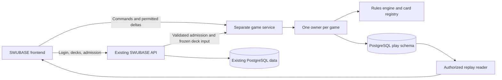

# Crossfire architecture proposal

For the implemented system and remaining Coolify work, see
[architecture and operations](../../../docs/crossfire/architecture-and-operations.md).
This document retains the original design proposal.

The agreed refinements to journal storage, snapshot retention, replay caching,
undo and bookmarks are in the
[next implementation plan](history-replay-and-undo.md), awaiting user review.
Use that plan for the next phase's design where it refines the original proposal
below; consult the operations guide for behavior actually implemented today.

Current pre-release decision: keep only the newest engine executable. Do not
retain/rebuild earlier experimental versions as part of routine development.
Keep strict version checks and current-version recovery tests. Historical game
compatibility and executable retention below are future release requirements,
to revisit before real user games are collected.

Milestone 0 now implements the headless core under `play/`; see the
[working engine guide](../../../docs/crossfire/engine-core.md) for its actual
contracts. The initial package keeps browser-safe DTOs in `play/view/`, with
separate `host/` and `projection/` modules. The deployment, persistence, shared
wire locations, and frontend layout below remain proposals for later milestones.
Integrate the existing view contract deliberately rather than duplicating it.

All paths and contracts labeled proposed describe future work. Current evidence
was inspected on 2026-09-08 at SWUBASE commit
`31e3e20ee44937c40faf597b0c5761b60386161c`; production capacity was not measured.

## Recommendation

Keep one repository and the existing frontend. Add a separately deployed game
service and a framework-independent engine under a root `play/` directory. Use
the same SWUBASE accounts through an authenticated admission flow. Start with the
existing PostgreSQL database and a dedicated `play` schema, with separate access
and connection budgets. Reconsider a separate database instance when measured
storage, write volume, or operational requirements justify it.

Crossfire uses an original engine and card implementations, as selected by the
user. Design the rules runtime from the official rules and the contracts below.
Its state format, execution model, transport, and test suite are authored here;
there is no third-party game-engine dependency or extraction milestone.

## Why these boundaries fit Crossfire

| Requirement | Design consequence |
| --- | --- |
| Fillable scenarios and restart recovery | Normalized, versioned plain state with explicit references and validated constructors |
| Choices within resolving effects | Serializable execution frames that record the remaining work and decision owner |
| Hidden information and incremental transport | Project each viewer's allowed state first, then compute that view's delta |
| Multiple identical cards and useful historical logs | Separate catalog identity, physical copy, rules incarnation, and permitted viewer handle |
| Saved replay across card updates | Persist accepted facts and complete checkpoints, pin the rule/card bundle, and retain compatible readers |
| Many games without competing with web requests | Separate game service, with one serialized command queue and authoritative owner per game |
| Same accounts and decklists | Existing SWUBASE API handles identity and deck access; admission supplies validated game inputs |

These are requirement-driven choices to prove with Crossfire's own scenarios and
load measurements. Keep the module boundaries small enough to change a storage
or hosting decision without rewriting card rules.

## What exists in SWUBASE

| Verified source | Implication |
| --- | --- |
| [server/index.ts](../../../server/index.ts), [server/app.ts](../../../server/app.ts) | One Bun/Hono entrypoint handles API and WebSockets and serves the built frontend; migration currently runs from server startup |
| [server/auth/auth.ts](../../../server/auth/auth.ts) | Better Auth owns sessions, GitHub/Google login, trusted origins, and worktree cookie prefixes |
| [server/routes/ws/game-results.ts](../../../server/routes/ws/game-results.ts) | Existing authenticated sockets and 4401/4403 close behavior are useful references |
| [server/lib/ws/gameResultsRealtime.ts](../../../server/lib/ws/gameResultsRealtime.ts) | Rooms are process-local maps; they do not route games among workers |
| [server/routes/decks/_id/json/get.ts](../../../server/routes/decks/_id/json/get.ts) | Access-controlled reads already distinguish normal and card-pool decks and support public/unlisted/owner visibility |
| [server/lib/decks/deckExport.ts](../../../server/lib/decks/deckExport.ts) | Main and sideboard export conventions exist; gameplay must freeze an internal deck snapshot |
| [server/db/schema/game_result.ts](../../../server/db/schema/game_result.ts) | Results are per-user statistics with `(userId, gameId)` uniqueness; this is not an authoritative match store |
| [lib/swu-resources/types.ts](../../../lib/swu-resources/types.ts), [server/db/lists.ts](../../../server/db/lists.ts) | Official cards are static catalog data, with logical IDs separate from print variants and catalog-source IDs |
| [server/lib/cards/cardListProvider.ts](../../../server/lib/cards/cardListProvider.ts) | A separate merged provider includes active previews; official entries win collisions |
| [frontend/package.json](../../../frontend/package.json), [frontend/vite.config.ts](../../../frontend/vite.config.ts) | React/Vite/TanStack and Motion already exist; development currently proxies all `/api` traffic to one backend |
| [drizzle.config.ts](../../../drizzle.config.ts) | Migration discovery currently covers `server/db/schema/*`; a new schema must be deliberately included |
| [scripts/remote-dev/sql/001-core-data.sql](../../../scripts/remote-dev/sql/001-core-data.sql) | Contributor sanitization explicitly handles domain tables; new private game tables need explicit exclusion |

## Boundaries and placement

Proposed organization:

```text
play/
  engine/           Rules runtime, serializable state, effect execution, selectors
  cards/            One definition file per mechanical card, registry, coverage
  server/           Separate HTTP/WS entrypoint, game actors, projections, storage
  testing/          Scenario builders, fixtures, rules and recovery test harness
  package.json      Runtime dependencies and focused checks
  tsconfig.json     Own build boundary
types/play/         Browser-safe commands, views, patches, log and replay DTOs
shared/play/        Pure wire validation and patch application helpers
server/routes/play/ Authenticated admission, deck snapshot preparation, user-facing metadata
server/db/schema/   Drizzle declarations for the proposed play schema
frontend/src/components/app/play/  Board, lobby, replay, scenario UI
frontend/src/api/play/             Lobby/history HTTP hooks
frontend/src/stores/play/          Per-game projected state and connection state
frontend/src/routes/               Thin router entries following local conventions
```

Keep the original rules runtime in `play/engine/` and individual card definitions
in `play/cards/`. The registry resolves SWUBASE catalog IDs to those definitions,
including explicit files for vanilla and keyword-only cards. Catalog conversion
prepares immutable engine input; it does not introduce a second rules runtime.

The engine imports no Hono, React, sockets, database clients, service secrets, or
wall-clock APIs. Browser code imports only permitted views and shared helpers,
never the full state types through a runtime barrel. Enforce this with package
exports/import checks when implementing. Give the game package focused build
settings and explicitly configure its relationship to root TypeScript checks.

The same origin exposes the frontend and authenticated control endpoints. The
reverse proxy sends game WebSockets directly to the game service, for example
`/api/ws/play/:gameId`; the main API is not in the per-action path. Vite and
worktree tooling will need explicit game-service routing and an isolated local
port. Give the service its own CPU/memory limits, pool budget, health checks,
draining policy, and deployment lifecycle.



## Login and deck admission

Keep Better Auth as the identity authority. Do not add a second account system,
copy OAuth tokens into the game service, or trust a user ID sent by a client.

Proposed flow:

1. The browser uses its normal SWUBASE session to request a game seat or spectator
   admission. The API validates Origin/CSRF protections, membership, invitations,
   and access to the selected deck.
2. The API reads and validates the deck through a shared domain helper respecting
   both persistence models. Freeze leader/base IDs, mainboard, sideboard, selected
   format, catalog/implementation versions, and a canonical content hash. Board 3
   is excluded. Limited pool/trash rows must not accidentally become an oversized
   constructed sideboard. Read metadata/content consistently; do not rely solely
   on `deck.updatedAt`, which current mutations do not always bump.
3. Transfer this input server-to-server and persist it as private game input.
   The browser receives only its admission response and metadata it may see.
4. Issue a short-lived, single-use opaque ticket scoped to game, user, session
   identity, seat/role, and allowed view. Redeem it atomically through the trusted
   admission store/API. Do not place tickets in URLs or access logs. The browser
   sends the ticket as its first WebSocket message; pending sockets have strict
   authentication timeouts and receive no game data.
5. Validate the configured browser Origin on upgrade and the ticket before room
   membership. For this browser endpoint reject missing or unexpected Origin;
   use separate authentication for any future non-browser integration.

Use HTTPS/WSS for deployed browser traffic and authenticated private transport
for service-to-service admission. Local development follows the worktree's
configured access profile.

A ticket's expiry governs redemption. An admitted connection needs its own
session validity policy: bounded revalidation/revocation, account-ban and sign-out
handling, and expiry without an infinite reconnect loop. A reconnect obtains a
fresh ticket for the same server-owned seat. Default to one controlling socket
per seat; replacement fences the previous socket and pending commands.

The game service needs only minimal identity metadata and access to its own
tables. It should not import the side-effectful main app or hold general access
to OAuth accounts, user collections, and all private decks. Game metadata sent
to an opponent must not expose a private/unlisted deck's source link or full
list through an otherwise innocent deck ID. Existing public decklists remain
public, but they reveal neither current hands nor shuffled order.

## Full state, visible state, and changes

Use three explicit layers:

1. **Authoritative state:** all cards, deck order, choices, effect execution,
   history, random outcomes, and private information. Server only.
2. **Projected view:** exactly what one viewer may currently know and choose.
3. **View delta:** the difference between that viewer's previous and next view.

Compute `diff(project(before, viewer), project(after, viewer))`. Do not compute a
full-state patch and attempt to remove secrets afterward. Project semantic log
and animation records under the same permissions. An internal event is neither
automatically public nor interchangeable with a wire patch.

Proposed authoritative modules:

| Module | Necessary contents |
| --- | --- |
| Identity and versions | Game/match IDs; state, engine, card bundle, catalog, format and rules versions |
| Players | Player IDs, seat order, ownership, base and leader references; no assumption of exactly one opponent in shared primitives |
| Zones | Shared ground/space arenas; each player's base/resources/deck/hand/discard; ordered deck membership |
| Card instances | Mechanical ID, physical instance ID, current incarnation, owner/controller, active face/role, damage, exhaustion, attachments, captor |
| Turn structure | Setup step, phase/round, active player, initiative holder and claimed status, passes, eliminated players |
| Resolution | Explicit execution frames, program position, trigger batches and nesting, costs, replacement history, pending decisions |
| Effects and history | Constant/lasting/delayed effects, last known information, per-round occurrences, responsibility, persistent Epic Action usage |
| Randomness | Algorithm/version and private state or recorded draws; never exposed to players |
| Disclosure | Rules-based temporary inspection/reveal grants and game-level viewer policies |

Keep state as versioned plain data with references rather than a cyclic class
graph. Classes can define behavior, but functions/closures/class instances are
not the durable format. Rebuild caches and derived power/HP/legality from the
canonical state; do not maintain competing writable copies of derived values.

Three distinct card identities are necessary: the catalog `cardId`, the physical
`instanceId` of this copy in the game, and its rules `incarnation` when it enters
play as a new copy. A separate opaque `viewCardId` addresses a visible object on
the wire. A fourth catalog concern, `variantId`, selects artwork, not behavior.
Epic Action usage may survive incarnation changes; ordinary temporary modifiers
do not. Preserve rule-specific identity exceptions deliberately.

Concealed hand/deck views generally need counts, not persistent instance IDs.
Facedown resources may need opaque selection handles plus public owner and
ready/exhausted status. Reassign handles when resource rearrangement or another
rule breaks tracking. A card moving into a hidden randomized group must not
retain a wire identifier linking it to its earlier public identity. This
mapping is viewer-specific and versioned; reconnect may begin a new view epoch.

## Executing an action and sending updates

Represent an action as a resumable state machine, not one long HTTP transaction
or an async function suspended waiting for a player. A command advances execution
until the next legal decision or settled state. Persist the continuation at that
boundary. There may be several decisions within one turn, sometimes answered by
someone other than the active player.

The proposed engine contract is a deterministic transition over plain state:

```text
advance(state, input, rulesBundle) -> { nextState, facts, suspension }
```

This is contract notation, not an existing API. Input is either a validated
player decision or an explicit server input such as a timeout or random result.
The rules bundle supplies stateless, versioned card/effect handlers. Execution
frames contain handler IDs, arguments, position, and prior results; they never
hold a suspended callback. On a random request the engine suspends, the host
supplies an unbiased server-generated result, and the engine records its use in
the candidate transition. The committed journal includes that private result.

Keep action legality and cost payment, effect execution, rule maintenance,
trigger ordering, and derived selectors as distinct modules. Run maintenance
and collect/resolve trigger batches at the official timing windows, rather than
applying one generic callback loop after every command. Card definitions compose
these primitives; only the transition machinery writes canonical state.

Proposed command envelope:

```ts
type PlayCommand = {
  gameId: string;
  commandId: string;         // Retry identity, scoped to authenticated user + game
  viewEpoch: string;
  expectedViewRevision: number;
  decisionId: string;
  optionId: string;          // Server-issued legal choice
  selections?: string[];     // Authorized view handles, validated again on receipt
};
```

Commands convey intent. They do not set HP, move arbitrary cards, declare costs,
name the acting user, or supply shuffle seeds. Revalidate legality, role, decision,
targets and limits at execution time. Remember the receipt and request hash so a
retry cannot execute twice and reusing an ID for different content is rejected.

Each game has one actor: an in-memory state plus a serialized command queue.
Advance into a candidate state, then atomically persist the events/continuation,
command receipt, and revision using the current owner fence and expected stored
revision. Only after commit promote the state and send viewer updates. The engine
must leave the previous committed state intact while constructing the candidate.
On failed commit discard speculative progress and resolve any uncertain commit
from durable state/receipts before accepting another command. A persistence outage
pauses progress without issuing a success acknowledgment. A lost acknowledgment
after commit is handled by the durable command receipt.

Proposed delta envelope:

```ts
type GameViewDelta = {
  type: 'play.delta';
  protocolVersion: number;
  gameId: string;
  viewEpoch: string;
  fromRevision: number;
  toRevision: number;
  changes: ViewChange[];       // Typed entity upserts/removals and zone changes
  log: VisibleLogEntry[];
  animations: VisibleAnimation[];
};
```

`ViewChange` is a closed, validated union over projected modules. Entity updates
and zone membership apply atomically to prevent cards appearing twice. These are
view-local revisions; server journal sequence numbers stay internal so private
substeps do not unnecessarily expose their count. Scope every resume buffer and
cache to game, viewer permissions, epoch, and connection state.

Send an initial permitted snapshot. Subsequently send deltas, ignoring duplicate
or old revisions. On a gap, unsupported protocol, expired buffer, role change, or
permission change, discard the old projection and request a replacement snapshot.
Do not combine deltas from different seats or epochs. Bound reconnect backoff,
stop on authorization failure, and reclaim sockets/queues on close. Bound a slow
spectator's output buffer and resynchronize/disconnect that viewer instead of
allowing it to stall the game's command queue.

Use a dedicated normalized frontend store per game, with selectors for cards
and zones. Keep TanStack Query for lobby, history, and metadata. Do not put the
whole live board through Query invalidation on each action or persist private
hand views into Dexie by default. Logout/role changes clear private client state.

## Visibility, spectators, logs, and animation

| Information | Normal players | Normal spectator |
| --- | --- | --- |
| Faceup board, discard, captured card identity | Visible | Visible |
| Own hand and own controlled resources | Visible | Hidden |
| Opponent hand/resource faces | Hidden unless rule/policy grants access | Hidden |
| Deck identities/order | Hidden from everyone except explicit rule-granted inspection | Hidden |
| Zone counts, resource exhaustion and ownership | Public | Public |
| Pending private choices and search candidates | Only the authorized chooser | Hidden |

Keep distinct settings for allowing spectators, revealing hands to players,
revealing hands to spectators, and postgame replay disclosure. Hand reveal does
not reveal resources, deck order, or private searches. Increasing game-level
disclosure requires all affected players' consent; commit that policy change in
game history. Rule-mandated reveals resolve without an extra consent step.
Revocation stops future disclosure and starts a new view epoch, but
cannot erase information already seen. A spectator may choose to hide hands the
game permits them to see; that UI preference cannot grant additional access.

Prevent an active participant from obtaining an elevated spectator view of the
same game through another connection. Delayed viewing, if added, must delay the
entire permitted stream, including logs, hand updates, and responses—not just
animations. Default spectator chat should stay separate from player chat during
play to avoid unwanted coaching; both are rate-limited and safely rendered.

Log records are structured: event ID, template, actor, typed card references,
event-time visible labels, and visibility classification. A reference carries
the safe visible handle/incarnation when available and an event-time historical
representation. Hover highlights the exact currently visible incarnation, not
every copy sharing a name. If it has left play or become hidden, show only the
authorized historical information; never follow an internal physical ID into a
hidden zone or highlight a later incarnation as the old object.

Send semantic animation cues alongside committed deltas: source/destination,
public card handle, event ID and ordering. These capture intermediate public
actions that a final-state diff alone might erase, such as a unit entering and
being defeated in the same resolution. The board's accepted state advances
independently of the visual animation queue. Support skip/reduced motion and
fast-forward on reconnect. Reuse existing Motion and card image primitives after
checking that hover/image preload behavior cannot request concealed identities.

## Persistence and replay

Start with these conceptual tables in a proposed `play` PostgreSQL schema:

| Table | Responsibility |
| --- | --- |
| `matches` / `games` | Lobby/match relationship, game number, lifecycle, owner fence/lease, versions, disclosure policy, final result |
| `participants` | SWUBASE text user IDs, seat/role, access and disclosure consent |
| `deck_snapshots` | Immutable private deck input plus mechanical IDs/content hash; source deck reference optional |
| `events` | Ordered authoritative facts, random outcomes, decisions and resumable state changes; unique `(game_id, seq)` |
| `snapshots` | Complete versioned recovery checkpoints at a journal sequence, including pending execution |
| `command_receipts` | Durable deduplication/result lookup for accepted commands |
| `chat_messages` | Separate from rules events, with its own audience and retention |
| `scenarios` | Versioned data definitions, ownership, sharing, rules bundle and optional authorized replay provenance |
| `outbox` | Idempotent completion publication into existing game-result statistics |

These are design responsibilities, not a migration to copy verbatim. Keep
structured relational metadata and JSONB event/snapshot payloads. Avoid a row per
card movement and avoid rewriting an entire game's JSON history each action.
Use one migration owner through SWUBASE's existing Drizzle workflow; a game
worker must not independently race the main app's startup migrations. Verify
schema-qualified discovery and permissions before rollout.

An active actor loads once and progresses in memory. Append durable events at
every accepted command/decision; take periodic complete checkpoints and release
finished/idle actors under explicit lifecycle rules. On restart, claim ownership,
load the latest compatible checkpoint, apply the remaining events, rebuild
derived state, and restore the exact decision. Checkpoint frequency comes from
measured recovery time and event volume rather than an invented constant.

Use unbiased server-side randomness, such as cryptographic uniform integer
draws in Fisher–Yates. Record outcomes privately, or use a versioned secure
generator with server-only seed/state plus recorded outcomes. Test scenarios may
inject deterministic randomness; production commands cannot select it. Replaying
must never reshuffle. Public hashes must not be computed from low-entropy secrets
or expose recoverable random seeds.

Persist **what happened**, not just button clicks. Historical playback applies
recorded facts/presentation events and must not recompute old matches using
today's card text. Pin engine/rules/card/catalog/event-schema versions, retain
the required reducers/projectors/assets, and include intermediate public log and
animation events. A private journal is never downloaded into a browser to drive
replay. Project its timeline server-side with both event-time visibility and the
requester's replay entitlement; knowing a card later must not reveal it earlier.

Participants can view their original perspectives. An omniscient replay is a
separate disclosure choice requiring all affected players' consent, and its
release must wait until the match ends if subsequent games could benefit from
the disclosure. Restrict arbitrary replay exports and scenario-from-replay
creation using the same policy. Playback can be supported by retained event
reducers; resuming/forking a historical position additionally requires the
matching executable engine/card bundle or an explicitly validated migration.
Unsupported historic versions should fail explicitly, not silently change rules.

A separate database on the same PostgreSQL instance would not isolate CPU/disk
load and would remove easy cross-schema relations. A separate instance would
isolate those resources, with backup/restore, identity references, and eventual
result integration to operate. Start with schema/role/pool separation; move the
game store when measured contention or retention requirements warrant it. Avoid
new cascading FKs that make deck/user deletion unexpectedly destroy matches;
coordinate anonymization, replay revocation, and private-record deletion under
the selected retention policy. User IDs are text, not UUIDs.

Private journals, deck snapshots, tickets, chat, and seeds must be excluded from
public contributor dumps explicitly, including all tables in the new schema.
Public sharing of a replay does not authorize publishing its authoritative
journal. Keep raw payloads and credentials out of logs/Sentry; operational
telemetry needs IDs, durations, queue sizes, and sanitized error codes. Large
finished archives can later move to private object storage with checksums and
authorized reads; public card-image storage is not the place for game journals.

## Concurrency and operations

One process can own many independent games. This meets concurrent-game support;
it does not require one process/container per game. Start with a bounded worker
pool, scheduling each game on one worker and containing long or failing rule
resolution so it cannot block every game. Enforce action/queue/memory limits and
yield between resumable execution steps. An operational execution limit should
pause/report an unresolved game, not invent a winner or silently skip effects.

Before multiple service replicas: establish a game-to-worker directory,
lease/ownership fencing in durable writes, and routing of commands/reconnects to
that owner. Sticky load balancing alone cannot prevent split ownership after a
failure. A shared pub/sub bus may help spectator fan-out, but it is not the game
authority. Old owners must fail both lease renewal and fenced writes; only
committed state may be emitted to their clients. Drain workers on deployment and
keep compatible old bundles available until their games finish.

Measure active games, actor memory, event-loop lag, queue wait, engine time,
commit latency, bytes per viewer, spectator fan-out, and restart time. Load tests
must mix active games and spectators. Do not estimate production capacity from
card count or the fact that the game is turn-based.
