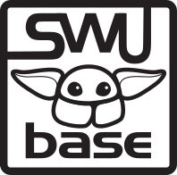

    <picture>
        <source srcset="./frontend/src/assets/logo-dark-theme.svg" media="(prefers-color-scheme: dark)" />
        <source srcset="./frontend/src/assets/logo-light-theme.svg" media="(prefers-color-scheme: light)" />
        
    </picture>

[//]: # (

)

# SWU Base - Your Star Wars: Unlimited Companion App

SWU Base is an all-in-one toolset for Star Wars: Unlimited players, providing comprehensive features to manage your collection, build decks, track cards, and connect with other players.

## Tech stack
- **Frontend**: React, TypeScript, Tailwind CSS, TanStack Router, TanStack Query
- **Backend**: Hono, PostgreSQL, Drizzle ORM
- **Runtime**: Bun for both server and client

## Contribution
We welcome contributions from the community! Whether it's fixing bugs, adding features, or improving documentation. See our [Contributing Guide](CONTRIBUTING.md) for more information.

## 🔗 Links

- [Discord Community](https://discord.gg/W3XhDSb4jz)
- [GitHub Repository](https://github.com/the-medo/swu-collection)

## Legal

SWU Base is an unofficial fan site. Information presented on this site about Star Wars: Unlimited (including images and symbols) is copyright Fantasy Flight Publishing Inc and Lucasfilm Ltd. SWU Base is not endorsed or produced by FFG or LFL in any way.

## License

This project is licensed under the AGPL-3.0 License - see the LICENSE file for details.