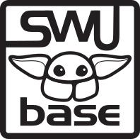

<p align="center">
    <picture>
        <source srcset="./frontend/src/assets/logo-dark-theme.svg" media="(prefers-color-scheme: dark)" />
        <source srcset="./frontend/src/assets/logo-light-theme.svg" media="(prefers-color-scheme: light)" />
        
    </picture>
</p>

[//]: # (<div style="width: 100%; text-align: center;"></div>)

# SWU Base - Your Star Wars: Unlimited Companion App

SWU Base is an all-in-one toolset for Star Wars: Unlimited players, providing comprehensive features to manage your collection, build decks, track cards, and connect with other players.

## Tech stack
- **Frontend**: React, TypeScript, Tailwind CSS, TanStack Router, TanStack Query
- **Backend**: Hono, PostgreSQL, Drizzle ORM
- **Runtime**: Bun for both server and client

## Screenshotter setup

The server screenshotter uses Playwright Chromium. After installing root dependencies, install the browser binary with:

```bash
bun run screenshotter:install
```

The production Dockerfile installs Chromium and its system dependencies with Playwright's `--with-deps` option.

Run tournament screenshots with:

```bash
bun run screenshotter:tournament -- --tournament-id <uuid>
```

For local smoke checks without R2 upload:

```bash
bun run screenshotter:tournament -- --tournament-id <uuid> --skip-upload --output-dir .tmp/screenshots/<uuid>
```

## Sanitized contributor database backup

The server-only [`create-sanitized-db-backup.sh`](scripts/remote-dev/create-sanitized-db-backup.sh) script creates a contributor-safe database dump from a Coolify backup. Its configuration belongs in the server's untracked `.env`; see `.env.example` for the required variables.

Its reviewed baseline rules are in `scripts/remote-dev/sql/`; they remove credentials and sensitive integration fields, retain only opted-in user data, and fail the export if privacy assertions do not pass. Run it from the server with an explicit source:

```bash
./scripts/remote-dev/create-sanitized-db-backup.sh --source local --timestamp latest
./scripts/remote-dev/create-sanitized-db-backup.sh --source r2 --timestamp 1786676402
```

The temporary database is never assigned a host port. On success or failure, the script removes the temporary container and all local dump files.

For a Coolify-managed scheduled job, deploy
[`scripts/remote-dev/docker-compose.coolify.yml`](scripts/remote-dev/docker-compose.coolify.yml)
as a separate private Compose Service. Configure the real backup host path and
R2 write credentials only in Coolify, then target the `sanitizer` container
with the command documented in that Compose file. The job deliberately has no
Docker-socket mount, domain, or published port.

## Parallel local worktrees

Linux/WSL worktrees can run independently, each with its own labelled PostgreSQL
container, volume, ports, auth-cookie namespace, and frontend/backend URLs:

```bash
scripts/worktree-dev/swubase-worktree-dev setup
scripts/worktree-dev/swubase-worktree-dev up
scripts/worktree-dev/swubase-worktree-dev status
```

The agent-neutral
[`bootstrap-worktree.sh`](scripts/worktree-dev/bootstrap-worktree.sh) installs
dependencies and provisions a fresh worktree before its first run. The first
setup uses an ignored local `pg-dump.dmp` when available; otherwise it downloads
the public sanitized dump through a checksum-verified manifest. See
[`scripts/worktree-dev/README.md`](scripts/worktree-dev/README.md) for refresh,
cleanup, public-data boundaries, and the optional Codex Desktop adapter.

## Contribution
We welcome contributions from the community! Whether it's fixing bugs, adding features, or improving documentation. See our [Contributing Guide](CONTRIBUTING.md) for more information.

## 🔗 Links

- [Discord Community](https://discord.gg/W3XhDSb4jz)
- [GitHub Repository](https://github.com/the-medo/swu-collection)

## Legal

SWU Base is an unofficial fan site. Information presented on this site about Star Wars: Unlimited (including images and symbols) is copyright Fantasy Flight Publishing Inc and Lucasfilm Ltd. SWU Base is not endorsed or produced by FFG or LFL in any way.

## License

This project is licensed under the AGPL-3.0 License - see the LICENSE file for details.
