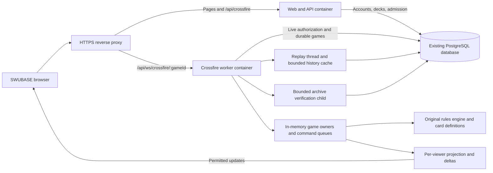

For dynamic card updates and compatible replay versions, see [card releases](card-releases.md).
For the existing SWUBASE Dockerfile + Traefik deployment, follow the
[production setup runbook](production-setup.md) for exact Coolify fields,
environment values, migration order and access grants.

# Crossfire architecture and operations

This guide describes the history/replay implementation validated on 2026-09-11.
The local worktree, migrated PostgreSQL database and dedicated worker image were
checked. Production Coolify resources and their configuration were not inspected
or deployed; the included Compose file is a reference for that environment.
The [playtesting tools](playtesting.md) and [match coordinator](matches.md) guides
describe the chat, reports, rematches and sideboarding added on 2026-09-13.

Crossfire shares SWUBASE's repository, frontend, accounts, decks and PostgreSQL
database. Gameplay runs in a separate Bun process. Active positions live in that
process's memory, with every accepted command committed to PostgreSQL before
clients are notified. Redis, a message broker and a separate gameplay database
are not required by the implementation.

## Components and request paths



The diagram is the recommended production container arrangement. These process
and API boundaries already exist. [Dockerfile.crossfire](../../Dockerfile.crossfire)
and a [Compose reference](../../play/deploy/compose.example.yml) supply the worker
image and proxy route; deployment-specific values still need to be configured.

| Location                                                                                                                       | Responsibility                                                                     |
| ------------------------------------------------------------------------------------------------------------------------------ | ---------------------------------------------------------------------------------- |
| [play/engine](../../play/engine/index.ts)                                                                                      | Deterministic rules, validated state, costs, effects, decisions and checkpoints    |
| [play/cards](../../play/cards/registry.ts)                                                                                     | Explicit registry and one definition per canonical card; reprints share behavior   |
| [play/host](../../play/host/durable-game.ts)                                                                                   | Per-game serialization, server randomness, commit-before-publication and recovery  |
| [play/storage](../../play/storage/postgres.ts)                                                                                 | PostgreSQL journal, checkpoints, command receipts and worker ownership             |
| [play/worker](../../play/worker/index.ts)                                                                                      | Separate Bun WebSocket listener, loaded-game lifecycle and bounded connections     |
| [play/projection](../../play/projection/projector.ts), [play/view](../../play/view/types.ts)                                   | Private state to permitted views; browser-safe messages and modular deltas         |
| [server/routes/crossfire.ts](../../server/routes/crossfire.ts), [server/lib/crossfire](../../server/lib/crossfire/lobbies.ts)  | Existing-auth admission, deck validation/snapshots, lobbies and connection tickets |
| [frontend Crossfire components](../../frontend/src/components/app/crossfire/BoardPosition.tsx)                                 | Lobby, board, card interaction, prompts, animations and the visible game log       |
| [play/testing](../../play/testing/scenario.ts), [play/integration](../../play/integration), [play/browser](../../play/browser) | Scenarios, rules/recovery tests, database/network tests and browser exercises      |

The current production web entrypoint serves the built frontend as well as the
API. A second frontend container is therefore optional. The game engine imports
neither React nor application services. UI layout can change without rewriting
card rules, provided the view/command contract is preserved.

## PostgreSQL: same database, separate schema

No new PostgreSQL database or database container is needed. Both processes use
`DATABASE_URL` for the existing SWUBASE database. The dedicated `play` schema is
a namespace within that database, not another database or an automatic security
boundary.

[The Drizzle declarations](../../server/db/schema/crossfire.ts) define:

| Table                     | What it retains                                                                                               |
| ------------------------- | ------------------------------------------------------------------------------------------------------------- |
| `play.card_bundles` | Immutable installed JSON card releases identified by version/checksum |
| `play.games`              | Engine/rules/card/state pins, latest committed sequence/revision/hash, worker owner and lease                 |
| `play.journal_live`            | Each accepted command, recorded engine/random inputs, emitted facts, resulting hash and durable retry receipt |
| `play.journal_history` | Verified compressed completed games, including initial snapshot, branches and retry receipts |
| `play.checkpoints`        | Full private serialized positions, including hidden cards and unfinished resolution                           |
| `play.lobbies`            | Waiting/started/cancelled lobby, game association and agreed disclosure settings                              |
| `play.participants`       | Seats, account/session references, immutable accepted deck snapshots and connection generations               |
| `play.connection_tickets` | Hashed, expiring, single-use live/replay admission tickets |
| `play.undo_requests` | Pending/accepted opponent approvals pinned to one committed head |
| `play.bookmarks` | Account-owned labels and stable logical positions |
| `play.practice_requests` | Consent from both original players and independent practice-game identity |

The ordinary application migration `0057_crossfire` creates the complete
Crossfire schema, including live/completed journals, lobbies, tickets, undo,
bookmarks, practice, chat, reports, matches, invitations and immutable card bundles.
The development migrations were consolidated before release; see the
[migration baseline](migration-baseline.md) for custom SQL and existing local data.

Apply the branch's complete pending migration sequence with `bun run db-migrate`
against the intended database. No separate Crossfire migrator is required.
Card-only releases require neither SQL migrations nor an engine redeployment.
New engine capabilities have their own runtime and state compatibility contract.

The [web entrypoint](../../server/index.ts) currently calls the migrator after
starting its listener. The game worker does not run migrations. For deployment,
run a migration step to completion before admitting traffic to either process;
do not rely on the worker starting successfully while the API is still migrating.

The API's Crossfire services have a separate native pool capped at four
connections; the worker has a native pool capped at eight. A lazy replay thread
adds up to two connections and the finalizer child up to two more while running.
The admin card-release service has a lazy native pool capped at two connections.
These are additional to the normal API pool. They share the same PostgreSQL storage, I/O and failure
domain. Separate SQL roles/grants have not been provisioned by these migrations.

Moving only the worker to a different database would not work as configuration
alone: admission and live authorization query SWUBASE accounts/sessions, lobby
transactions freeze existing decks, and participant/lobby tables reference
`public.user`. Separate database hosting would require an explicit redesign of
those boundaries. Start by separating gameplay compute and measure database load.

## Accounts, decks and hidden information

The main API uses the existing Better Auth session to check deck access and
create/join a lobby. Both accepted decklists are frozen in PostgreSQL, so later
deck edits cannot change the running game. Joining accepts the exact proposed
spectator and hand-disclosure settings and creates the initial game atomically.

The API issues a short-lived single-use ticket (30 seconds by default). The
browser sends it in the first WebSocket message, not in the URL. Only a hash is
stored. Players and spectators both authenticate; live session/ban/seat checks
continue after connection, and replacing a player's connection invalidates the
old one. Replay tickets have a separate purpose and do not replace the playing
connection. There is no second Crossfire account system.

Each connection gets its own server-side projection. Players can inspect their
own hand/resources; opponents and spectators receive only permitted identities.
Hand reveal to players and hand reveal to spectators are separate lobby settings.
Spectators can hide hands they are allowed to see; that toggle grants no extra
access. Changing the game's agreed disclosure policy during play is not yet
implemented.

Initial connection and resynchronization send a complete permitted view. Normal
updates diff that viewer's projected state and send changed modules/card/log
entries only. Private-only changes do not increment the viewer's revision.
The frontend never receives a raw checkpoint, full journal, private random input
or unredacted authoritative delta. Scoped handles and incarnation-aware log
references identify exact visible copies without tracking cards through hidden
shuffles. See [transport](transport.md) for command and delta contracts.

## How a running game lives in memory

[GameWorker](../../play/worker/games.ts) holds a map of loaded games. Each entry
shares one [DurableGame](../../play/host/durable-game.ts), one serialized command
queue and one database ownership lease across its players and spectators. A game
is a lightweight object in the worker process, not its own container or thread.
All games share the process's JavaScript execution capacity; separate queues
prevent overlapping transitions within one game and allow asynchronous work for
other games while a database request is pending.

A position is versioned plain data: cards indexed by physical identity, players,
zones, damage, exhaustion, attachments, captured cards, usage history, pending
triggers and explicit execution frames. Frames record the remaining instructions
when an effect pauses for a player's choice. Card definitions supply behavior;
checkpoints contain no serialized functions or live JavaScript class instances.

Current development defaults are 128 loaded/loading games, 32 queued operations
per game, a 15-second ownership lease, and a one-second maintenance tick. The
listener allows 512 connections total and 64 per game, reserving two places for
players. `CROSSFIRE_MAX_GAMES` configures loaded-game capacity; other listener
limits remain code defaults. These are bounds, not measured production capacity.

After the last connection releases its game binding, the worker retains the game
for two minutes, then releases its lease and memory. PostgreSQL still retains the
game. Reconnection loads the committed position on demand; startup does not load
every saved game. Disconnecting does not currently cause an automatic concession
or introduce a turn-clock timeout.

## What happens for each action

1. The browser submits a legal option/selection using opaque handles and a
   unique command ID. It cannot submit a replacement game state or choose a seat.
2. The worker checks the authenticated connection and queues the action for that
   game. A saved receipt can answer a repeated command without executing it again.
3. The engine validates the choice and computes a candidate state. The server
   supplies cryptographic random outcomes when the engine requests them.
4. One PostgreSQL transaction checks current ownership and live authorization,
   writes the command journal and optional checkpoint, and advances the game head.
5. Only after the commit succeeds does the host adopt the candidate and publish
   permitted views/acknowledgments.

A new game gets an initial setup checkpoint. The initiative command records
the initial deck shuffles; command entries include all random inputs caused by
that command, so recovery never reshuffles. A full checkpoint is stored every 20 accepted commands and at
a terminal position. Each checkpoint transaction retains the initial snapshot
and the newest recovery snapshot, deleting older non-initial snapshots. The host still serializes/hashes each resulting state to
verify journal integrity; the checkpoint interval reduces stored snapshots, not
all serialization work.

During play, the database retains private checkpoints as text and journal
inputs/facts as JSONB. After verification, [completed histories](history.md) replace
these live rows with one compressed archive containing the initial snapshot and
all journal entries. It does not store a full card-by-card snapshot for every action, and the
journal is not the WebSocket delta stream. Checkpoints have an 8 MiB SQL limit.
The [storage and latency benchmark](history-benchmark.md) records measured core
allocation for synthetic 6–10-round games. It does not establish production
capacity or bound every possible long game.

## Restarts, crashes and retries

Recovery reads a consistent database snapshot containing the committed head,
latest checkpoint and subsequent journal entries. It requires matching engine
pins, decodes the checkpoint, replays recorded inputs and verifies revisions,
facts and resulting hashes. It can resume an unfinished choice inside an action.

| Event                                            | Current behavior                                                                                                    |
| ------------------------------------------------ | ------------------------------------------------------------------------------------------------------------------- |
| Browser refresh or temporary disconnect          | Obtain a new ticket and permitted snapshot; retain the committed game and pending decision                          |
| Worker exits gracefully                          | Stop admission, close sockets, drain running work and release ownership; process shutdown has a ten-second deadline |
| Worker is killed                                 | Lose the RAM copy; another owner can recover after the old lease expires, subject to service/reconnect availability |
| Crash before the database commit                 | No accepted transition is published; an uncommitted command may be retried                                          |
| Commit succeeds but acknowledgment is lost       | Retry the same command ID/payload; its durable receipt prevents duplicate play/randomness                           |
| Database write fails or its outcome is uncertain | Pause/retire the actor and recover the committed position before accepting more play                                |
| Incompatible engine is deployed                  | Reject unsupported majors/state contracts; compatible minor releases keep original card pins                            |

A database ownership generation, or fence, increases on takeover. Every write
must match the current owner and fence, so a late operation from an old worker
cannot overwrite the replacement owner's game. PostgreSQL availability and a
preserved database remain prerequisites; a lease is not a database backup.

## Replays, executable versions and backups

Account history and the replay board support previous/next step, five-step jumps,
action navigation, seeking, playback speed, perspectives and preserved undo
branches. The replay thread reconstructs positions from recorded inputs and
caches every five actions plus requested positions. The cache is shared per game,
but each socket receives its own permitted view or delta. It expires after four
minutes without a meaningful seek or accepted game command; an idle tab and
connection heartbeats do not keep it warm.

Opponent-approved undo restores the start of the current or immediately previous
root action, including nested plays and triggers. The request is durable, pauses
gameplay and expires after 60 seconds. Acceptance records a new branch; abandoned
positions remain in replay. Undo cannot erase information already seen.

Bookmarks retain account-owned logical positions across compaction and restarts.
From a nonterminal bookmarked position in a finalized game, both original players
can consent to an independent private practice game. It has its own initial state,
history and source provenance; no old tickets, sessions or leases are copied.
See [history](history.md) for permissions, action boundaries and exact contracts.

Live recovery uses the worker's **currently imported engine**. It does not load a
saved JavaScript executable from a database row or require a game-state filesystem
volume. The separate `play:archive` tooling builds the newest committed executable
into ignored `.swubase/crossfire-bundles` and verifies replay/fresh-process recovery.
Those generated files are executable test/recovery artifacts, not saved matches.

Card-only releases activate from durable JSON bundles without restarting the API
or game worker. Existing matches/replays retain their data pins; compatible minor
engine updates preserve historical behavior. See [card releases](card-releases.md)
for activation, required environment and historical checks. Executable archive
pruning is separate from retention of historical card data.

For Coolify, PostgreSQL needs persistent storage and backups that include the
`play` schema. The worker's container filesystem does not need to retain active
game data. Completed histories are compressed in PostgreSQL by a bounded child process
owned by the game worker. This needs no new database, R2 credentials or Redis
service; obsolete live rows are removed only with verified archive publication. A persistent volume alone is
not a backup. Coolify's [storage documentation](https://coolify.io/docs/applications/configuration/persistent-storage)
explains how mounts keep data outside replaceable application containers.

Private gameplay is deliberately excluded from public contributor dumps by
[the sanitizer](../../scripts/remote-dev/sql/000-crossfire.sql), and producer
exports exclude `play.*` table data. Sanitized development dumps preserve the
empty schema; they cannot recover production games. Account/deck removal does
not automatically erase game history. Retention, user deletion and abandoned-game
cleanup therefore need explicit product and operational policies.

## Recommended Coolify deployment

Use the existing web/API service, add **one** Crossfire worker service, and keep
the existing PostgreSQL service. Put the worker, API and database on a suitable
private Docker network. The database URL must use a reachable internal database
name/port; container-local `127.0.0.1` would refer to that application container.
Coolify's [networking model](https://coolify.io/docs/core/networking-in-coolify)
uses private container networking and routes public traffic through its proxy.

Build [Dockerfile.crossfire](../../Dockerfile.crossfire) from the same application
revision as the API/frontend. It pins Bun 1.3.14 by default, installs production
dependencies, runs as the `bun` user and starts `play/worker/index.ts` directly.
Its Dockerfile-specific ignore file excludes local environments, generated
worktree data and build artifacts. No gameplay volume is required on this image.

```bash
docker build -f Dockerfile.crossfire -t YOUR_REGISTRY/swubase-crossfire:REVISION .
```

[The Compose reference](../../play/deploy/compose.example.yml) expects the image,
existing private network, database URL and exact public origin. It publishes no
host port. Its Traefik route gives `/api/ws/crossfire/` priority over the normal
web route, forwards to port 3110 and explicitly selects the private network.
Use the existing website's HTTPS entrypoint/certificate; adapt route names and
priority to the proxy already configured in Coolify. Keep the regular web route
for `/api/crossfire` and frontend pages. Coolify's
[Compose documentation](https://coolify.io/docs/applications/builds/docker-compose)
describes required environment variables and network configuration.

The reference begins at two CPUs and 2 GiB memory. These are operational starting
limits, not a tested promise of 128 concurrent games. The replay budget counts
encoded state/index bytes, not total heap/RSS; leave headroom for active games,
projection, decoded histories, temporary copies and the finalizer child. See
[worker configuration](worker.md#runtime-configuration) and
[measurements](history-benchmark.md).

| Setting                    | Web/API service                    | Crossfire worker                                   |
| -------------------------- | ---------------------------------- | -------------------------------------------------- |
| Start command              | `bun run start`                    | `bun run play:serve`                               |
| `DATABASE_URL`             | Existing SWUBASE database          | Same database, reachable on the private network    |
| `CROSSFIRE_ENABLED`        | `1`                                | `1`                                                |
| `BETTER_AUTH_URL`          | Actual public SWUBASE origin       | Same public SWUBASE origin, used for Origin checks |
| Bind address               | Existing `HOST` configuration      | `CROSSFIRE_HOST=0.0.0.0` inside the container      |
| Internal port              | Existing API port, default `3010`  | Explicit `CROSSFIRE_PORT`, for example `3110`      |
| Persistent gameplay volume | None on this application container | None; PostgreSQL is the durable store              |

The API retains its existing Better Auth configuration. The worker validates
HTTP-issued tickets and database sessions; its entrypoint does not configure a
second OAuth application or require a duplicate login service.

Route `/api/ws/crossfire/:gameId` to the worker, with precedence over the normal
`/api` route, preserving the path and browser Origin and supporting WSS. Route
pages and normal API calls to the web service. The browser's default socket URL
uses the existing website origin, so this arrangement adds no user-facing port
or OAuth callback. A separate socket origin is possible through the frontend's
build-time `VITE_CROSSFIRE_WS_URL`, but is not needed for this arrangement.

Deployment work still required:

- Create the separate worker resource from the supplied image/Compose reference
  and configure its actual private network, origin, credentials and proxy route.
  Vite's proxy is development-only; the root web Dockerfile starts only the API.
- Align the container Bun version with a verified runtime. The Dockerfile defaults
  to **1.2.19**; the dedicated worker image and Crossfire validation use
  **1.3.14**. Set/test the web image build argument to use the matching runtime.
- Run migrations before game admission; deploy compatible API, worker and frontend
  revisions. Plan for reconnects, old game leases and unsupported historical major versions.
- Configure supervision, resource limits and shutdown grace compatible with the
  worker's drain deadline. `/health` reports listener availability, not database
  readiness or available game capacity; add suitable operational monitoring.
- Establish PostgreSQL backup/restore, retention and production load checks.
  The dedicated worker build excludes generated environments/data. Independently
  audit the existing web image build context; its Dockerfile copies the build
  context and does not inherit `Dockerfile.crossfire.dockerignore`.

Do not put several current workers behind ordinary round-robin routing. Ownership
fencing prevents conflicting writes, but a request arriving at a worker that does
not own the game receives temporary unavailability. Game-to-worker routing and
coordinated draining are not implemented. Browser-specific sticky sessions alone
would not ensure both players and every spectator reach the game's owner.

## Local development

Local Linux/WSL development uses a Docker PostgreSQL 16 container per worktree.
Bun runs the API and game worker on the host; Node runs the Vite development
server. Each worktree has its own database volume, ports, generated URLs and auth
cookie prefix. It does not run the full production container stack locally.

For a fresh worktree:

```bash
scripts/worktree-dev/bootstrap-worktree.sh
# Supply development-only .env settings, including CROSSFIRE_ENABLED=1.
scripts/worktree-dev/swubase-worktree-dev up
scripts/worktree-dev/swubase-worktree-dev status
```

Bootstrap installs dependencies and provisions/migrates the isolated database;
`up` starts the services. An existing worktree can use the idempotent `setup` and
`up` commands. The generated root/frontend `.env.worktree` files supply the local
DB, ports and proxy settings and are used by the launcher. They complement the
reviewed development `.env`, which supplies application/auth configuration.
The launcher loads both. Keep generated files out of Git and do not edit or copy
them manually.

The inspected Crossfire worktree is `/home/medo/dev/swubase-crossfire`. Its current
addresses, which other worktrees should obtain from `status`, are:

| Component              | Current worktree address                   |
| ---------------------- | ------------------------------------------ |
| Frontend loopback      | `http://localhost:5174`                    |
| Private HTTPS frontend | `https://steamdeck.tail73a93e.ts.net:5174` |
| API                    | `http://127.0.0.1:3011`                    |
| Worker                 | `http://127.0.0.1:3110`                    |
| PostgreSQL             | `127.0.0.1:5443`                           |

Vite forwards the game socket path to the worker before its generic API proxy.
The optional private HTTPS mapping preserves the same frontend origin. Use
`logs crossfire` for the worker and `down` to stop this worktree while retaining
its database. `refresh-db` replaces development data; `down --purge-data` destroys
the selected worktree's database volume. Follow the
[worktree guide](../../scripts/worktree-dev/README.md) for those operations.

Validation entrypoints are `bun run play:check`, the explicitly targeted local
`play:storage:test`, and `play:browser:test`/`play:browser:gallery` against running
services. `play:history:browser` exercises replay/undo/bookmarks/practice;
`play:history:benchmark` measures history storage and cache behavior using the
explicit local test database. See [benchmark instructions](history-benchmark.md).
Archive/verify after committed engine changes when testing the retained
executable. The scenario builder and test fixtures run through the same engine;
a user-facing scenario editor/import API is still future work.

## Current limits of the feature

Persistent hosting, same-account admission, frozen decks, spectators, private
views, modular socket updates and a card-driven board are implemented. The
practice engine is currently two-player; card support and competitive format
legality are separate checks. Chat, public replay browsing/sharing, scenario UI,
matchmaking and distributed worker routing remain further work. Production
capacity and a completed Coolify deployment have not been established by the
headless test suite or the local screenshot gallery.
